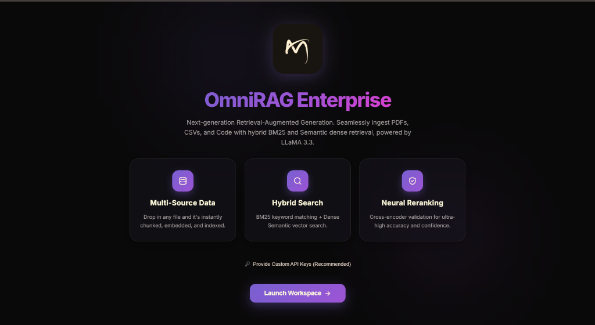
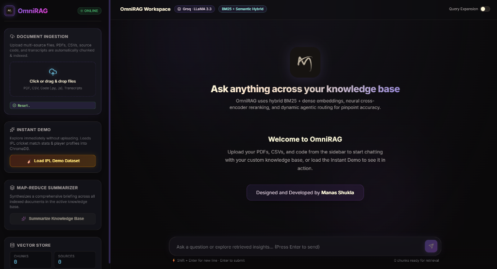

# OmniRAG Enterprise: Next-Gen Multi-Source RAG Assistant


<div align="center">
  
  <p><i>State-of-the-art Hybrid Search, Neural Reranking, and Agentic Routing in one premium workspace.</i></p>
</div>

---

## 📑 Table of Contents

| Section | Description |
|---------|-------------|
| [🧠 Overview](#-omnirag-enterprise-next-gen-multi-source-rag-assistant) | Project introduction and badges |
| [⚠️ Problem](#-the-problem) | The challenge of fragmented enterprise data |
| [💡 Solution](#-the-solution-omnirag-enterprise) | How OmniRAG solves hallucination and retrieval |
| [🛠️ Tech Stack](#-the-tech-stack) | Core technologies and models used |
| [🎯 Logic Flow](#-strategic-logic-flow) | Hybrid search and reranking architecture |
| [🚀 Quick Start](#-quick-start) | Setup and deployment instructions |
| [🌟 Key Features](#-key-features) | Standout functionalities |
| [💼 Use Cases](#-use-cases) | Practical applications |
| [👋 Connect](#-socials) | Social links |

---

## ⚠️ The Problem
Enterprise data is fragmented across PDFs, CSVs, and raw source code. Standard RAG (Retrieval-Augmented Generation) pipelines rely purely on semantic similarity, which fails catastrophically on exact keyword searches (like IDs or names) and frequently hallucinates when faced with massive, multi-source document ingestion.

## 💡 The Solution: OmniRAG Enterprise
A comprehensive, full-stack AI workspace that doesn't just embed text—it orchestrates an intelligent **Hybrid Retrieval Pipeline**. By combining exact keyword matching (BM25) with dense vector semantics and passing the results through a Cross-Encoder Neural Reranker, OmniRAG guarantees pinpoint accuracy. 

### 🛠️ The Tech Stack
* **Frontend:** React + Vite (Premium Glassmorphism UI)
* **Backend:** FastAPI (Python)
* **Vector Database:** ChromaDB (Local Persistent Storage)
* **LLM Engine:** Meta LLaMA 3.3 (via Groq for ultra-fast inference)
* **Retrieval Algorithms:** BM25 (Lexical) + Dense Semantic Embeddings + Cross-Encoder Reranking

---

## 🎥 Application Demo

### The Home Page (Secure API Onboarding)
<div align="center">
  
</div>

### The Chat Workspace (Live RAG)
<div align="center">
  
</div>

---

## 🎯 Strategic Logic Flow

### 1. Multi-Source Ingestion
Drag and drop PDFs, CSVs, or `.js`/`.py` code files. The system intelligently routes the file to the correct chunking algorithm (Semantic Chunking for prose, Fixed/AST Chunking for code) and embeds it into ChromaDB.

### 2. Hybrid Retrieval Engine
When a query is received, the system forks the search:
* **Lexical Path (BM25):** Searches for exact keyword matches.
* **Semantic Path (Dense Vectors):** Searches for contextual meaning.

### 3. Neural Reranking (The Accuracy Edge)
The results from both paths are merged and passed to a **Cross-Encoder Model** which scores the exact relevance of each chunk against the user's prompt, filtering out noise and presenting only the absolute highest-confidence data to the LLM.

---

## 🚀 Quick Start

### Option 1: One-Click Hugging Face Deployment (Recommended)
This project is packaged and ready for Hugging Face Spaces!
1. Create a new **Docker** Space on [Hugging Face](https://huggingface.co/spaces).
2. Upload the contents of the deployment folder (`Dockerfile`, `requirements.txt`, `server.py`, and `frontend/dist`).
3. The Space will automatically build the React app and launch the FastAPI server!

### Option 2: Local Development
1. **Clone the Repository:**
   ```bash
   git clone https://github.com/manas-shukla-101/OmniRAG.git
   cd OmniRAG
   ```
2. **Install Backend Dependencies:**
   ```bash
   python -m venv .venv
   source .venv/Scripts/activate  # (Windows)
   pip install -r requirements.txt
   ```
3. **Run the Server:**
   ```bash
   python server.py
   ```
4. Access the gorgeous UI at `http://localhost:8000`.

---

## 🌟 Key Features

- **Dynamic Agentic Routing:** Intelligently routes queries based on context.
- **Map-Reduce Summarizer:** Synthesizes massive knowledge bases into concise executive briefs.
- **Glassmorphic UI:** A visually stunning, highly interactive frontend.
- **Dynamic API Key Configuration:** Securely supply your own Hugging Face and Groq keys directly from the UI to prevent rate limits.

## 💼 Use Cases

- **Codebase Onboarding:** Upload a massive repo and chat with your code.
- **Financial Analysis:** Ingest CSV datasets and ask complex comparative questions.
- **Legal Document Review:** Upload contracts (PDFs) and extract exact clauses without hallucinations.
- **Enterprise Internal Wikis:** A centralized brain for company knowledge.

---

**Designed and Developed with ❤️ by Manas Shukla**

---

## 🌐 Socials:
[](https://manas-shukla-portfolio.framer.website) [](https://instagram.com/manas_shukla_101) [](https://linkedin.com/in/manas-shukla-006774370) [](mailto:shuklamanas8928@gmail.com)
